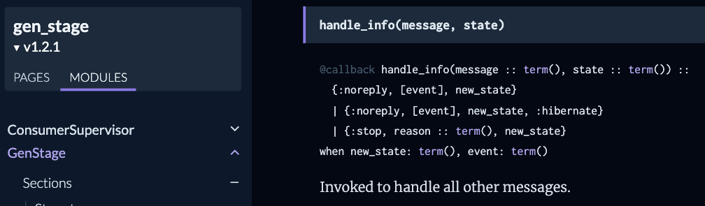

# Building a framework
Membrane's journey to 1.0

<h6 style="position:absolute;bottom:100px;">Mateusz Front</h6>


---

# let's build a framework!

wait, what's a framework?

---

```elixir
    {:ok, base_image} = Image.open("test/support/images/Singapore-2016-09-5887.jpg")
    {:ok, singapore} = Text.new_from_string("Singapore", font_size: 100, font: "DIN Alternate")

    base_image
    |> Image.compose!(singapore, x: :center, y: :middle)
    |> Image.write!("/Users/kip/Desktop/center_text.png")
```

---


---

```elixir
defmodule MyAppWeb.ThermostatLive do
  # In Phoenix v1.6+ apps, the line below should be: use MyAppWeb, :live_view
  use Phoenix.LiveView

  @impl Phoenix.LiveView
  def render(assigns) do
    ~H"""
    Current temperature: <%= @temperature %>
    """
  end

  @impl Phoenix.LiveView
  def mount(_params, %{"current_user_id" => user_id}, socket) do
    temperature = Thermostat.get_user_reading(user_id)
    {:ok, assign(socket, :temperature, temperature)}
  end
end
```

---

```elixir
defmodule MyAppWeb.Router do
  use Phoenix.Router
  import Phoenix.LiveView.Router

  scope "/", MyAppWeb do
    live "/thermostat", ThermostatLive
  end
end
```

---

## Framework

- Abstractions
- Implementations
- Mechanism that calls them

---

## Framework

- Is more complex
- Is generic
- It's important to create abstractions properly

---

## How to create good abstractions?

- Trust your feelings
- ~~Steal~~ get inspired by other tools
- Have some implementations and build abstractions on top of them

---

<!-- 
## Membrane - motivation

- Project (digital radio engine)
- Insufficient tooling
- Found a niche

---

## Plan

- Choose the right tech stack
- Create better tooling
- Use the new tooling in the project
- The tool is way more generic than needed for the project

---

- Playback states
- Demand-based flow control

---

## Better plan

- Don't create a generic framework
- Implement only what's needed for the project
- Verify that the project works
- Preferably do that with more projects
- Then implement a generic framework

--- -->

# implementations -> abstraction

---

# know your abstractions

---

## Pipeline


---


---


---


---

## Don't use your abstraction for code organisation

- Processes
- GenStage
- Membrane elements

---

# How to create good abstractions in Elixir?

---

```elixir
defmodule MyAppWeb.ThermostatLive do
  # In Phoenix v1.6+ apps, the line below should be: use MyAppWeb, :live_view
  use Phoenix.LiveView

  @impl Phoenix.LiveView
  def render(assigns) do
    ~H"""
    Current temperature: <%= @temperature %>
    """
  end

  @impl Phoenix.LiveView
  def mount(_params, %{"current_user_id" => user_id}, socket) do
    temperature = Thermostat.get_user_reading(user_id)
    {:ok, assign(socket, :temperature, temperature)}
  end
end
```

---

```elixir
defmodule MyAppWeb.Router do
  use Phoenix.Router
  import Phoenix.LiveView.Router

  scope "/", MyAppWeb do
    live "/thermostat", ThermostatLive
  end
end
```

---

## Callback-based interfaces

- Intuitive
- Easy to implement
- Limited

---


---



---


---


---

## Callback-based interfaces

- Intuitive
- Easy to implement
- Limited

---

```elixir
  @impl true
  def handle_event(:output, %ReceiverReport.StatsEvent{stats: stats}, _ctx, state) do ...

  @impl true
  def handle_event(:output, %Membrane.KeyframeRequestEvent{}, _ctx, state) do ...

  @impl true
  def handle_event(:output, %RTP.RetransmissionRequestEvent{packet_ids: ids}, _ctx, state) do ...
```

---

```elixir
  @impl true
  def handle_event(:output, %ReceiverReport.StatsEvent{stats: stats}, _ctx, state) do ...

  @impl true
  def handle_event(:output, %Membrane.KeyframeRequestEvent{}, _ctx, state) do ...

  @impl true
  def handle_event(:output, %RTP.RetransmissionRequestEvent{packet_ids: ids}, _ctx, state) do ...

  @impl true
  def handle_event(pad, event, ctx, state), do: super(pad, event, ctx, state)
```

---

## Macro-based interfaces

- Need to learn from scratch
- Difficult to implement
- Flexible
- Optimisation possibilities

---

## How to callback?

- Actions
- Contexts

---

```elixir
@impl true
def handle_stream_format(:input, format, _context, state) do
  buffer = %Buffer{payload: create_header(format)}
  # subtracting 8 bytes as header length doesn't include "RIFF" and `file_length` fields
  state = Map.put(state, :header_length, byte_size(buffer.payload) - 8)

  {[stream_format: {:output, format}, buffer: {:output, buffer}], state}
end
```

---

```elixir
@impl true
def handle_info({:portaudio_payload, payload}, %{playback: :playing}, state) do
  {[buffer: {:output, %Buffer{payload: payload}}], state}
end
```

---

## Plug-in based architecture

- Core (Abstractions, core implementation)
- Plugins (Implementations)

---

# Monorepo or multirepo?

---

# Single package or multiple packages?

---

## Multiple packages

- Better compilation times
- No need to have all native dependencies installed
- Allows for removing deprecated code
- Well-defined relationships between plugins
- Enforces modularity
<!-- 
- Easier to contribute
- Improves flexibility -->

---
<!-- 


---


---


--- -->

## Multiple packages - drawbacks

- Dependency hell
- Maintenance cost
- Increases entry level

---


---


---


---

## Decrease entry level

- Gigachad package
- Demos (in Livebook?)
- Open source products

---

## Jellyfish


<br>


<!-- 
---


---

 -->

---


---

# github.com/jellyfish-dev

---

## Products
<br>
<br>
<br>
<br>


---

## What's 1.0?

4. Major version zero (0.y.z) is for initial development. Anything MAY change at any time. The public API SHOULD NOT be considered stable.

5. Version 1.0.0 defines the public API. The way in which the version number is incremented after this release is dependent on this public API and how it changes.


<i style="display:block;width:90%;text-align:right;">semver.org</i>

---

## When to 1.0?

- If your software is being used in production,
- If you have a stable API on which users have come to depend,
- If you’re worrying a lot about backwards compatibility,

<br>&emsp;&emsp;&emsp;**you should probably already be 1.0.0.**

<br>

<i style="display:block;width:90%;text-align:right;">semver.org/#faq</i>

<!-- ---

## When to 1.0?

- When you avoid a good change because it would break too much
- When unstable API bothers more than helps -->
<!-- 
---

## Keeping API stable

- Implement functionalities out of the framework
- Once they get validated, merge them into the framework

---

# if you break, break wisely

---

## Membrane & 1.0

- v0.11 was about API
- v1.0.0-rc0 was about missing parts

---

## Membrane & 1.0

- v0.11 was about API
- v1.0.0-rc0 was about missing parts
   ...and API
-->
---

## Membrane & 1.0

- v0.11 was about API
- v1.0.0-rc0 was about missing parts
   ...and API
- v0.12 will be about compatibility

---

# don't mix features with breaking changes

---

## Membrane Core 1.0 - when?

# Soon™

---

#  @ElixirMembrane

---

<br>

#  @ElixirMembrane

### Thanks!

